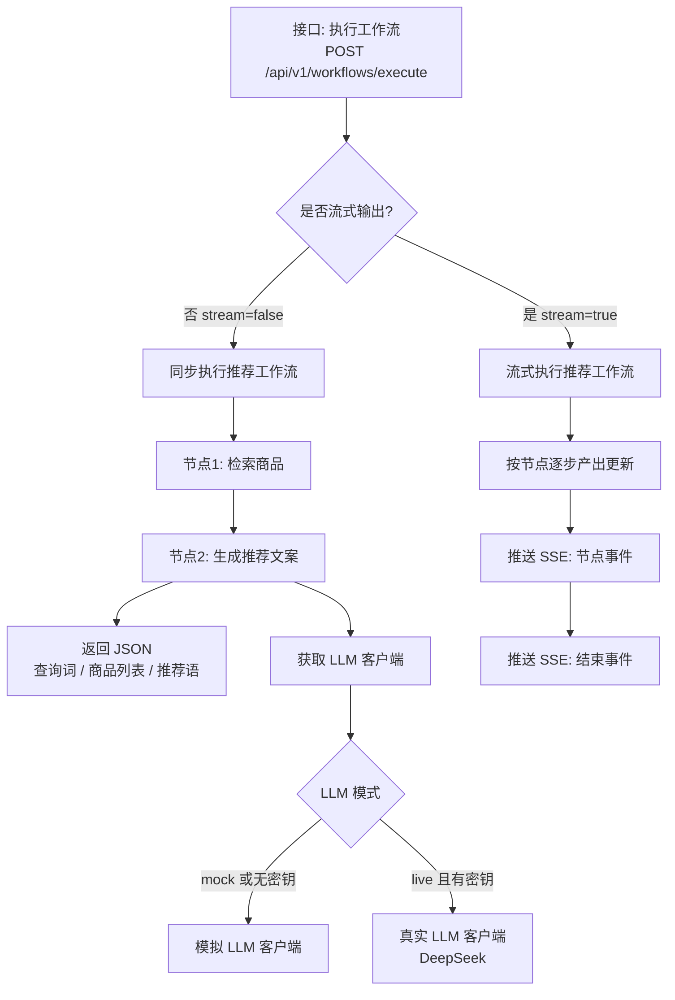

# 核心工作流(US-3)

## 阅读路径

```text
1. app/main.py                 — 挂载路由
2. app/api/v1/workflows.py     — HTTP 入口(JSON / SSE)
3. app/core/workflow.py        — LangGraph 状态与节点
4. app/services/llm_client.py  — LLM 工厂(有 Key 则 live;CI 无 Key 走 mock)
5. app/utils/sse.py            — SSE 行格式化
```

## 流程图



## 节点说明

| 节点(代码名) | 作用 |
|---|---|
| `retrieve_products` | 模拟商品检索(关键词过滤 MOCK_CATALOG) |
| `generate_recommendation` | 基于候选商品生成中文推荐话术 |
