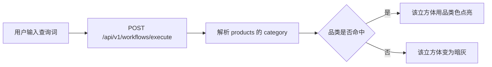

# US-4 3D 场景 MVP · 设计

日期: 2026-09-09
分支: `feature/4-3d-scene`
状态: 待实现

## 1. 目标

管理者打开前端首页，就能在 3D 场景里看到三个代表商品品类的立方体，可旋转/缩放。输入一句话调用现有工作流 API 后，命中的品类立方体点亮，未命中变暗。

验收对照 `standards/01-requirements.md` US-4:

| AC | 做法 |
|---|---|
| AC1 React Three Fiber + OrbitControls | `@react-three/fiber` + `@react-three/drei` 的 `OrbitControls` |
| AC2 至少 3 个不同颜色立方体 | 固定三件：外套 / 配饰 / 下装 |
| AC3 调后端 API 改立方体颜色 | `POST /api/v1/workflows/execute`，用 `products[].category` 决定高亮 |
| AC4 旋转缩放、>30fps | OrbitControls；三立方体无粒子/无后处理 |

## 2. 非目标（本 PR 不做）

- 后端改接口或改 `MOCK_CATALOG`
- React Router、Zustand、shadcn/ui
- 聊天导购 UI（US-5）
- 粒子、物流线、多视角（US-9）

## 3. 页面结构

替换当前文字占位首页，不新增路由。

```text
┌─────────────────────────────────────┐
│ 标题 + 查询输入 + 执行按钮 + 状态文案 │  ← HTML 叠加层
├─────────────────────────────────────┤
│                                     │
│     [外套]     [配饰]     [下装]      │  ← R3F Canvas 全屏
│      立方体      立方体      立方体     │
│                                     │
└─────────────────────────────────────┘
```

- 顶部条：标题「AI 电商智慧运营工作台」、query 输入、提交按钮、一行状态（空闲 / 请求中 / 错误 / 已高亮品类）。
- Canvas 铺满剩余视口。每个立方体上方用 drei `Html` 显示中文品类名，避免只靠颜色猜。

## 4. 数据流



- 请求：`{ "query": "<用户输入>", "stream": false }`，`VITE_API_URL` 默认 `http://localhost:8000`。
- 映射纯函数 `highlightCategories(products) -> Set<"外套"|"配饰"|"下装">`。
- 初始：三件都暗灰（尚未请求）。
- 点亮色（示例）：外套 `#3b82f6`，配饰 `#f59e0b`，下装 `#22c55e`；暗态统一 `#64748b`。
- 现有 mock 目录里「海边防晒」会命中三件；无关键词时后端退回前两件，则只有那两件的品类点亮。这是当前后端行为，前端不补偿。
- 失败：顶部显示错误文案；立方体保持上一帧颜色（含仍全灰）。
- 空 query：不发请求。
- 请求中：禁用按钮，状态显示「请求中」。

## 5. 前端模块

| 文件 | 职责 |
|---|---|
| `src/App.tsx` | 查询条、状态、把高亮集合传给场景 |
| `src/api/workflows.ts` | `executeWorkflow(query)` |
| `src/scene/ProductScene.tsx` | Canvas、灯光、OrbitControls、三个 `CategoryCube` |
| `src/scene/highlight.ts` | `highlightCategories` 纯函数 |
| `src/scene/highlight.test.ts` | 纯函数单测 |
| `src/App.test.tsx` | 标题、输入框；mock fetch 后点击会请求 |
| `e2e/scene.spec.ts` | Playwright：Canvas 存在、标签可见、mock API 后状态文案含命中品类 |

不在 jsdom 里测 WebGL 像素。

## 6. 依赖

- `three`
- `@react-three/fiber`
- `@react-three/drei`
- 开发/CI：`@playwright/test`

Playwright 用 `page.route` 拦截 `/api/v1/workflows/execute`，不依赖本机后端，CI 可复现。

## 7. 测试与 CI

- Vitest：映射函数 + App 请求行为。
- Playwright：启动 Vite；断言 `canvas`、三个品类标签、mock 响应后状态区出现「外套」等。
- CI `frontend` job 在 build 之后加 Chromium + `npx playwright test`。
- 不截 WebGL 图对比；不测 fps 数值（AC4 以三立方体 + 无后处理保证，人工拖一下验收）。

## 8. 风险

- jsdom 无 WebGL：场景逻辑必须可测部分抽成纯函数。
- CORS：后端已放开跨域，本地 5173 调 8000 可用。
- Playwright 会增加 CI 时间：只跑 Chromium 一条冒烟。
