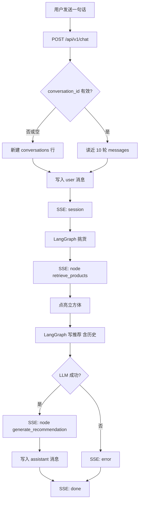

# US-5 智能导购（聊天切片）· 设计

日期: 2026-09-13
分支: `feature/5-ai-shopping-guide`
状态: 待实现

## 1. 目标

电商用户在首页右侧与导购对话：输入「推荐防晒衣」后，聊天里出现商品名和推荐理由；追问（如「再便宜点」）能接着上一轮。回复按工作流节点推送；商品一到，左侧 3D 品类立方体按类目点亮。会话写入 PostgreSQL，刷新后可续聊。

本切片覆盖 US-5 的 AC1 / AC3 / AC4。AC2（RAG 双路召回 + Rerank）明确放到下一个 PR。

| AC | 本切片 |
|---|---|
| AC1 「推荐防晒衣」→ 商品名 + 理由 | 复用现有两节点图 + 三件 mock 货架；理由进助手气泡 |
| AC3 多轮追问、改条件 | `conversation_id` + 表内存历史；prompt 带近 10 轮 |
| AC4 聊天界面 shadcn/ui | 右侧栏；引入 Tailwind + 少量 shadcn 组件 |
| AC2 RAG Hit Rate ≥ 0.85 | **不做** |

## 2. 非目标（本 PR 不做）

- RAG / 向量库 / BM25 / Reranker / 新商品语料
- 改 `MOCK_CATALOG` 或 `/api/v1/workflows/execute` 的对外契约
- Alembic 迁移框架（启动时 `create_all`）
- Token 级打字机；会话列表、登录、多用户隔离
- 重做 3D 皮肤；粒子与多视角（US-9）

## 3. 已拍板

- 布局：左侧 3D，右侧聊天；顶栏只留标题，去掉查询条
- 联动：每次导购返回的 `products` 立刻按品类点亮立方体（与 US-4 同一套 `highlightCategories`）
- 传输：SSE 按节点推（先商品，再推荐语）
- 存储：PostgreSQL；测试用 SQLite 内存库
- 接口：新建 `/api/v1/chat`，不塞进 `/workflows/execute`

## 4. 页面结构

```text
┌──────────────────────────────────────────────────┐
│ 标题：AI 电商智慧运营工作台                         │
├────────────────────────────────────┬─────────────┤
│                                    │ 气泡列表     │
│   [外套]   [配饰]   [下装]           │ 用户 / 助手  │
│    立方体    立方体    立方体         │             │
│                                    │ [输入框][发送]│
└────────────────────────────────────┴─────────────┘
```

- 不新增路由。
- `conversation_id` 存在 `localStorage` 键 `workbench.conversation_id`。
- 打开页面：若有 ID，则 `GET /api/v1/chat/{id}` 填气泡；404 则删键当新会话。

## 5. 数据流



工作流：在现有 `WorkflowState` 增加只读 `history`（`{role, content}[]`，最多 20 条 = 10 轮）。`retrieve_products` 不读历史；`generate_recommendation` 把历史和当前 query 一起塞进 prompt。对外 `/workflows/execute` 仍只收 `query`，`history` 默认为空。

## 6. 数据模型

`conversations`

| 列 | 类型 | 说明 |
|---|---|---|
| id | UUID PK | 即 `conversation_id` |
| created_at | datetime | |
| updated_at | datetime | 每轮消息后更新 |

`messages`

| 列 | 类型 | 说明 |
|---|---|---|
| id | UUID PK | |
| conversation_id | FK | |
| role | str | `user` 或 `assistant` |
| content | str | 用户原话或推荐语 |
| products | JSON 可空 | 仅助手消息：当时的商品列表 |
| created_at | datetime | 排序用 |

进程启动：`SQLModel.metadata.create_all`。不引入 Alembic。

连接：`DATABASE_URL`。本地/compose 用 Postgres；pytest 强制 `sqlite://`（内存，`check_same_thread=False`）。

## 7. HTTP

### `POST /api/v1/chat`

请求：

```json
{ "message": "推荐防晒衣", "conversation_id": null }
```

- `message`：1–500 字
- `conversation_id`：可选 UUID；有则必须已存在，否则 404

响应：`text/event-stream`

| 顺序 | event | data |
|---|---|---|
| 1 | `session` | `{ "conversation_id": "<uuid>" }` |
| 2 | `node` | `{ "retrieve_products": { "products": [ ... ] } }` |
| 3 | `node` | `{ "generate_recommendation": { "recommendation": "..." } }` |
| 4 | `done` | `{ "done": true }` |

LLM 失败时第 3 步改为 `event: error`，`{ "message": "<可读原因>" }`，然后仍发 `done`。不写助手行。商品节点若已发出，前端仍可点亮立方体。

### `GET /api/v1/chat/{conversation_id}`

```json
{
  "conversation_id": "<uuid>",
  "messages": [
    { "role": "user", "content": "推荐防晒衣", "products": null },
    { "role": "assistant", "content": "推荐轻薄防晒衣…", "products": [ { "id": "p1", "name": "轻薄防晒衣", "price": 199, "category": "外套" } ] }
  ]
}
```

不存在 → 404。

## 8. 前端模块

| 文件 | 职责 |
|---|---|
| `src/App.tsx` | 布局：标题 + 场景 + `ChatPanel`；高亮 state |
| `src/components/chat/ChatPanel.tsx` | 气泡、输入、发送、拉历史 |
| `src/api/chat.ts` | `streamChat`、`loadChat`；解析 SSE |
| `src/api/chatSse.ts` | 纯函数：把 SSE 文本块解析成事件 |
| `src/scene/*` | 沿用 US-4，不改点亮规则 |

依赖：Tailwind CSS、shadcn 的 `Button` / `Input` / `ScrollArea`。3D 画布继续用现有 CSS，不把整个首页改成 shadcn 主题系统。

发送中：禁用输入；用已收到的 event 显示「正在挑货 / 正在写推荐」。
保留一处 `role="status"` 文案（可放在聊天栏顶部，不必回到旧查询条），便于无障碍和 e2e 断言「已高亮: 外套」。

## 9. 错误处理

| 情况 | 行为 |
|---|---|
| 空消息 / 超长 | 前端不发；后端 422 |
| 会话 404 | 删 `localStorage`；提示「会话不存在，已开新对话」；用户可再发 |
| 数据库不可用 | 503；聊天栏「暂时连不上，请稍后」；立方体保持上一帧 |
| LLM 失败 | 见 SSE `error`；不落助手消息 |
| GET 历史失败 | 气泡空；不挡 3D；下次发送按无 ID 处理或提示重试 |

## 10. 测试与 CI

后端（pytest，SQLite，LLM mock）：

- 首轮：库中 1 会话 + user/assistant 各 1；SSE 顺序 `session → retrieve_products → generate_recommendation → done`
- 追问：第二条 user 的 prompt 侧能读到上一轮（断言 `generate_recommendation` 用到的 history 非空，或会话消息数递增）
- 未知 `conversation_id` → 404
- `message` 空 → 422
- LLM 抛错：有 `error` 与 `done`，无 assistant 行；若 retrieve 已成功则仍有 products 事件

前端：

- vitest：SSE 解析；`highlightCategories` 仍覆盖；ChatPanel 在 mock stream 后出现推荐语
- Playwright：右侧聊天可见；mock SSE 后发送「推荐防晒衣」出现推荐气泡且状态/立方体逻辑与 US-4 一致（拦截 `/api/v1/chat`，不依赖本机 Postgres）

CI：沿用现有 frontend/backend job；后端测试不启 Docker Postgres。

## 11. 风险

- Railway 若未挂 Postgres，线上聊天会 503。本 PR 文档写清 `DATABASE_URL`；不在本切片里改 Railway 插件（需人类在控制台加）。
- shadcn + Tailwind 首次引入会动 `index.css` / `vite` 配置，注意不要打坏 R3F 全屏高度。
- Windows 上 `create_all` + SQLite 文件锁：测试只用内存 URI。
- 内存以外的「近 10 轮」截断：只截 messages 表查询，不在 SSE 里回放超出部分。

## 12. 阅读路径（实现时）

1. `backend/app/models/chat.py` — 表
2. `backend/app/db.py` — 引擎 / session / `create_all`
3. `backend/app/core/workflow.py` — `history` 入图
4. `backend/app/api/v1/chat.py` — HTTP + SSE
5. `frontend/src/api/chatSse.ts` → `chat.ts` → `ChatPanel.tsx` → `App.tsx`
